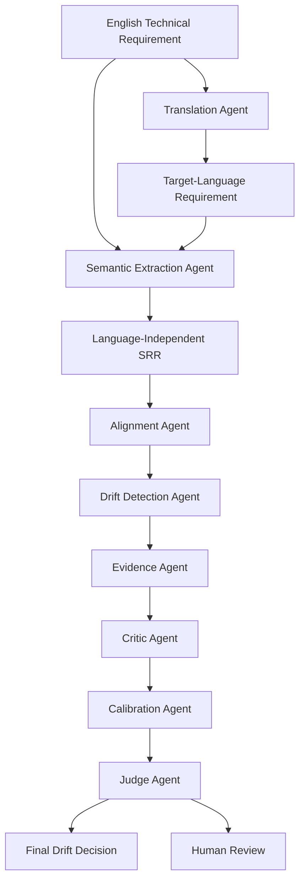

# IDRAAK

**An Interpretable Multi-Agent Framework for Detecting Semantic Drift and Faithfulness in Multilingual Technical Requirements**

IDRAAK evaluates whether the intended meaning of a technical requirement remains consistent when translated into multiple languages, paraphrased, or processed by language models. It detects semantic drift, identifies which technical attributes changed, estimates confidence, provides interpretable evidence, and compares single-model and multi-agent verification approaches.

## Architecture



## Key Features

- **Semantic Requirement Representation (SRR)**: Language-independent structured form for deterministic comparison
- **15 Drift Types**: Numerical, unit, polarity, modality, condition, temporal, threshold, entity, relation, exception, omission, addition, terminology, scope, reference
- **8 Specialized Agents**: Translation, Extraction, Alignment, Drift Detection, Evidence, Critic, Calibration, Judge
- **5 Workflows**: Direct judge, structured single-agent, full multi-agent IDRAAK, back-translation, ablation studies
- **Calibration**: Temperature scaling, Platt scaling, isotonic regression, histogram binning
- **12 Target Languages**: en, hi, ur, ar, zh, ja, es, fr, de, pt, tr, bn
- **Publication-Ready**: Tables (CSV/Markdown/LaTeX), plots (PNG/PDF), experiment tracking

## Results

Full experiment matrix on 890 perturbations across 300 technical requirements using GPT-4o-mini:

| Workflow | Provider | F1 | Accuracy | MCC | Time |
|----------|----------|-----|----------|------|------|
| Structured Single | Deterministic | 0.898 | 0.835 | 0.474 | 0.1s |
| Structured Single | OpenAI (gpt-4o-mini) | 0.879 | 0.799 | 0.277 | ~69min |
| **Direct Judge** | **OpenAI (gpt-4o-mini)** | **0.960** | **0.932** | **0.731** | **~29min** |
| Full IDRAAK | Deterministic | 0.898 | 0.835 | 0.474 | 0.2s |
| Full IDRAAK | OpenAI (gpt-4o-mini) | 0.895 | 0.821 | 0.297 | ~137min |

### Key Findings

- **Direct Judge achieves the best results** (F1=0.960, MCC=0.731) — a single GPT-4o-mini call with a well-crafted prompt outperforms both deterministic and multi-agent approaches on this benchmark.
- **Deterministic SRR comparison is a strong baseline** — instant, free, and F1=0.898. The structured extraction + field-level comparison approach is highly effective for controlled perturbations.
- **Hybrid extraction needs tuning** — adding LLM extraction to the structured comparison pipeline currently degrades MCC, as the merge logic between deterministic and LLM-extracted SRRs introduces false positives on paraphrases.
- **More agents ≠ better** — the full 8-agent IDRAAK pipeline with OpenAI underperforms the simpler direct judge, suggesting that error propagation across agents can outweigh the benefit of specialized reasoning.

## Research Questions

| RQ | Question |
|----|----------|
| RQ1 | How frequently does semantic drift occur in translated technical requirements? |
| RQ2 | Which categories of technical information are most vulnerable to drift? |
| RQ3 | Does structured comparison detect drift more reliably than embeddings or direct LLM? |
| RQ4 | Does multi-agent verification improve over single-agent? |
| RQ5 | Are confidence scores calibrated across languages? |
| RQ6 | Which languages experience the most semantic degradation? |
| RQ7 | Can field-level comparisons explain why drift occurred? |

## Installation

```bash
# Clone the repository
git clone https://github.com/idraak-research/idraak.git
cd idraak

# Install in development mode
pip install -e ".[dev]"
```

## Environment Setup

```bash
# Set your OpenAI API key (optional — demo works without keys)
export OPENAI_API_KEY=sk-...
```

## Quick Start

```bash
# Run the demo with mock providers (no API keys needed)
python3 -m idraak.cli demo

# Run complete pipeline: generate dataset -> evaluate -> report
python3 -m idraak.cli run

# Evaluate with OpenAI provider
python3 -m idraak.cli evaluate --provider openai --workflow direct_judge

# Run full experiment matrix across all workflows
python3 -m idraak.cli experiment-matrix --max-samples 50
```

## Commands

```bash
# Generate synthetic dataset (300 requirements + perturbations)
python3 -m idraak.cli generate-dataset --n 300

# Evaluate drift detection with specific workflow and provider
python3 -m idraak.cli evaluate \
    --workflow structured_single \
    --provider openai \
    --model gpt-4o-mini \
    --max-samples 100

# Run full experiment matrix (all workflow x provider combinations)
python3 -m idraak.cli experiment-matrix \
    --model gpt-4o-mini \
    --output-dir reports/experiments

# Run ablation studies
python3 -m idraak.cli run-ablation --ablation all

# Generate error analysis
python3 -m idraak.cli error-analysis

# Generate publication-ready reports
python3 -m idraak.cli generate-report

# Run tests
python3 -m pytest tests/ -v
```

## Dataset

The synthetic benchmark includes 300 technical requirements across:

**Domains**: Digital hardware, embedded systems, software, networking, cybersecurity, safety-critical, data processing, financial systems, healthcare devices, industrial automation

**Categories**: Functional behavior, timing/numerical/resource constraints, conditional behavior, negation, exception handling, sequence ordering, safety/security/interface/reliability/performance/power/compliance requirements

**Perturbations**: Each requirement generates labeled drift examples (numerical, unit, polarity, modality, condition, temporal, threshold, omission, scope, entity, terminology drift) plus semantically equivalent paraphrases. Total: 890 perturbations.

## Repository Structure

```
idraak/
├── src/idraak/
│   ├── schemas/         # Pydantic v2 models (SRR, drift, dataset, evaluation)
│   ├── agents/          # 8 specialized agents
│   ├── workflows/       # Direct judge, structured, full IDRAAK, back-translation, ablations
│   ├── providers/       # Mock, OpenAI-compatible providers
│   ├── extraction/      # Deterministic + hybrid SRR extraction
│   ├── drift/           # Field-level comparison engine + unit converter
│   ├── calibration/     # Post-hoc calibration methods
│   ├── evaluation/      # Metrics, baselines, error analysis, complexity scoring
│   ├── datasets/        # Dataset generator + splits
│   ├── perturbations/   # Controlled drift perturbation engine
│   ├── reporting/       # Tables (CSV/MD/LaTeX) + plots generation
│   ├── tracking/        # Experiment tracking (JSONL)
│   ├── ui/              # Streamlit annotation interface
│   ├── utils/           # Config, logging, caching, seeds
│   └── cli.py           # Typer CLI
├── configs/             # YAML configurations
├── prompts/             # Versioned prompt templates
├── glossaries/          # Multilingual domain terminology
├── data/                # Raw, interim, processed, sample data
├── reports/             # Generated tables, plots, experiment results
├── tests/               # Unit + integration tests (127 tests)
└── artifacts/           # Experiment runs and cache
```

## Configuration

All configuration is YAML-based in `configs/`. Key settings:

```yaml
# configs/default.yaml
privacy:
  allow_external_api: false  # Set true to use OpenAI/Anthropic

languages:
  enabled: [en, hi, ur, ar, zh, ja, es, fr, de, pt, tr, bn]

translation:
  provider: mock  # mock, openai

extraction:
  method: hybrid  # deterministic, llm, hybrid
```

## Adding a Language

1. Add to `configs/languages/default.yaml`
2. Add glossary entries to `glossaries/`
3. Enable in `configs/default.yaml`

## Adding a Provider

1. Implement `TranslationProvider` or `LLMProvider` protocol
2. Add to `src/idraak/providers/`
3. See `providers/openai_provider.py` as reference

## Testing

```bash
# Run all tests (127 tests, ~27s)
python3 -m pytest tests/ -v

# With coverage
python3 -m pytest tests/ -v --cov=src/idraak
```

## Privacy

- External API calls disabled by default (`IDRAAK_ALLOW_EXTERNAL_API=false`)
- API keys read from environment variables only
- Keys never logged or stored in output files
- Chain-of-thought not stored; only structured outputs and evidence spans

## Reproducibility

- All random seeds configurable and fixed
- API responses cached deterministically
- Model versions and prompt versions tracked
- Package versions recorded in experiment logs
- Pipeline supports resume from cached state

## Current Status

### Implemented
- Pydantic v2 SRR schemas with 10+ typed components
- Dataset generator (300 requirements, 10 domains, 15 categories)
- Controlled perturbation engine (11 drift types + paraphrases, 890 total)
- Deterministic + hybrid SRR extraction (with LLM-powered extraction)
- Field-level comparison engine with unit conversion
- 8 specialized agents with deterministic fallback + LLM support
- 5 workflows (direct judge, structured single, full IDRAAK, back-translation, ablations)
- Mock + OpenAI-compatible providers
- Classification metrics (accuracy, precision, recall, F1, MCC, AUROC, ECE, Brier)
- 4 calibration methods
- Embedding + token overlap baselines
- Full experiment matrix with real API calls (5 configurations)
- Ablation study (10 configurations)
- Error analysis (false positive/negative breakdown)
- Publication-quality plots and tables
- Experiment tracking (JSONL)
- Streamlit human annotation interface
- 127 unit + integration tests
- CLI with demo, generate, evaluate, experiment-matrix, run, ablation, error-analysis, report commands

### Pending
- Debate workflow (pro-drift vs no-drift agents)
- More domain glossaries (only digital_hardware complete)
- Edge case tests (mixed-language, RTL, Unicode, API timeout)
- HTML error analysis reports
- Cross-provider translation comparison
- W&B/MLflow integration
- Hybrid extraction merge logic tuning

## Citation

```bibtex
@software{idraak2025,
  title={IDRAAK: An Interpretable Multi-Agent Framework for Detecting Semantic Drift and Faithfulness in Multilingual Technical Requirements},
  year={2025},
  url={https://github.com/idraak-research/idraak}
}
```
