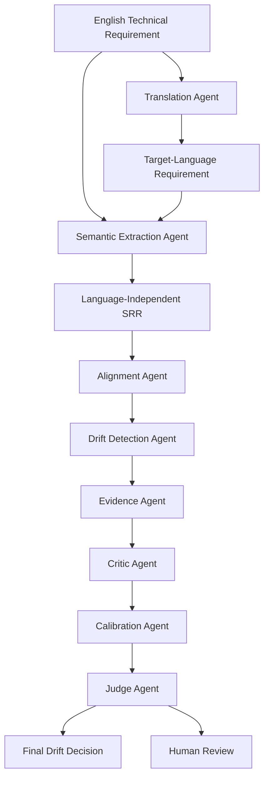

# IDRAAK

**An Interpretable Multi-Agent Framework for Detecting Semantic Drift and Faithfulness in Multilingual Technical Requirements**

IDRAAK evaluates whether the intended meaning of a technical requirement remains consistent when translated into multiple languages, paraphrased, or processed by language models. It detects semantic drift, identifies which technical attributes changed, estimates confidence, provides interpretable evidence, and compares single-model and multi-agent verification approaches.

> **If you find this work useful and would like to use or build upon it, please consider citing our paper.**

### Citation

```bibtex
@article{ahir2026idraak,
  title={IDRAAK: From Multi-Agent NLP to Few-Shot Prompting for Semantic Drift Detection in Technical Requirements},
  author={Ahir, Shiva},
  journal={arXiv preprint arXiv:2608.08801},
  year={2026}
}

## Architecture



## Key Features

- **Semantic Requirement Representation (SRR)**: Language-independent structured form for deterministic comparison
- **15 Drift Types**: Numerical, unit, polarity, modality, condition, temporal, threshold, entity, relation, exception, omission, addition, terminology, scope, reference
- **8 Specialized Agents**: Translation, Extraction, Alignment, Drift Detection, Evidence, Critic, Calibration, Judge
- **6 Workflows**: Direct judge (few-shot), ensemble (SRR+LLM), structured single-agent, full multi-agent IDRAAK, back-translation, ablation studies
- **Calibration**: Temperature scaling, Platt scaling, isotonic regression, histogram binning
- **12 Target Languages**: en, hi, ur, ar, zh, ja, es, fr, de, pt, tr, bn
- **Publication-Ready**: Tables (CSV/Markdown/LaTeX), plots (PNG/PDF), experiment tracking

## Results

### Synthetic Benchmark (IDRAAK)

Full experiment matrix on 890 perturbations across 300 technical requirements using GPT-4o-mini:

| Workflow | Provider | F1 | Accuracy | MCC | Time |
|----------|----------|-----|----------|------|------|
| Structured Single | Deterministic | 0.898 | 0.835 | 0.474 | 0.1s |
| Structured Single | OpenAI (gpt-4o-mini) | 0.918 | 0.863 | 0.501 | ~181min |
| **Direct Judge (few-shot)** | **OpenAI (gpt-4o-mini)** | **0.983** | **0.971** | **0.888** | **~17min** |
| Ensemble | OpenAI (gpt-4o-mini) | 0.926 | 0.869 | 0.411 | ~27min |
| Full IDRAAK | Deterministic | 0.898 | 0.835 | 0.474 | 0.2s |

### PAWSX Benchmark (Cross-lingual Paraphrase Detection)

805 adversarial paraphrase pairs across 5 languages (en, de, es, fr, zh):

| Workflow | Provider | F1 | Accuracy | MCC |
|----------|----------|-----|----------|------|
| Structured Single | Deterministic | 0.012 | 0.388 | -0.098 |
| Direct Judge | OpenAI (gpt-4o-mini) | 0.814 | 0.739 | 0.451 |
| **Ensemble** | **OpenAI (gpt-4o-mini)** | **0.817** | **0.738** | **0.459** |
| Structured Single | OpenAI (gpt-4o-mini) | 0.723 | 0.583 | -0.003 |
| Full IDRAAK | Deterministic | 0.012 | 0.388 | -0.098 |

### XNLI Benchmark (Cross-lingual Natural Language Inference)

700 premise-hypothesis pairs across 7 languages (en, hi, ar, zh, de, fr, es):

| Workflow | Provider | F1 | Accuracy | MCC |
|----------|----------|-----|----------|------|
| Structured Single | Deterministic | 0.396 | 0.533 | 0.074 |
| **Direct Judge** | **OpenAI (gpt-4o-mini)** | **0.671** | **0.510** | **0.101** |
| Ensemble | OpenAI (gpt-4o-mini) | 0.670 | 0.507 | 0.085 |
| Structured Single | OpenAI (gpt-4o-mini) | 0.669 | 0.520 | 0.091 |
| Full IDRAAK | Deterministic | 0.396 | 0.533 | 0.074 |

### Key Findings

- **Direct Judge is the best workflow across all benchmarks** — a single GPT-4o-mini call with a well-crafted few-shot prompt achieves MCC=0.888 on 890 synthetic perturbations, consistently outperforming both deterministic and multi-agent approaches.
- **Few-shot calibration dramatically improves performance** — adding 6 carefully selected examples to the direct judge prompt improved MCC from 0.731→0.888 (+21%) on the full 890-sample synthetic benchmark. The examples cover paraphrases, numerical drift, polarity inversion, and entity swaps.
- **Ensemble approach excels on adversarial benchmarks** — the ensemble workflow (deterministic SRR evidence + LLM judge) achieves the best MCC=0.459 on PAWSX, slightly outperforming direct judge (MCC=0.451), by providing structured evidence to guide the LLM's decision.
- **Deterministic SRR comparison excels on technical requirements** (F1=0.898) but fails on general text (PAWSX F1=0.012) — it relies on domain-specific patterns (modality, numerical constraints, units) that don't exist in general sentences.
- **LLM-based detection generalizes to real benchmarks** — direct_judge achieves F1=0.814 on PAWSX adversarial paraphrases, a challenging benchmark where even dedicated models struggle.
- **Cross-lingual NLI is hard** — XNLI maps imperfectly to drift detection (entailment≠paraphrase), explaining lower scores. The direct judge still outperforms all other approaches.
- **More agents ≠ better** — the full 8-agent pipeline underperforms the simpler direct judge, suggesting error propagation across agents outweighs specialized reasoning benefits.
- **Hybrid extraction merge matters** — fixing the merge strategy (deterministic always wins for comparison-critical fields) improved structured_single/openai from MCC=0.277→0.501 on the full benchmark.

## Research Questions

| RQ | Question |
|----|----------|
| RQ1 | How frequently does semantic drift occur in translated technical requirements? |
| RQ2 | Which categories of technical information are most vulnerable to drift? |
| RQ3 | Does structured comparison detect drift more reliably than embeddings or direct LLM? |
| RQ4 | Does multi-agent verification improve over single-agent? |
| RQ5 | Are confidence scores calibrated across languages? |
| RQ6 | Which languages experience the most semantic degradation? |
| RQ7 | Can field-level comparisons explain why drift occurred? |

## Installation

```bash
# Clone the repository
git clone https://github.com/shivaahir158/IDRAAK.git
cd IDRAAK

# Install in development mode
pip install -e ".[dev]"
```

## Environment Setup

```bash
# Set your OpenAI API key (optional — demo works without keys)
export OPENAI_API_KEY=sk-...
```

## Quick Start

```bash
# Run the demo with mock providers (no API keys needed)
python3 -m idraak.cli demo

# Run complete pipeline: generate dataset -> evaluate -> report
python3 -m idraak.cli run

# Evaluate with OpenAI provider
python3 -m idraak.cli evaluate --provider openai --workflow direct_judge

# Run full experiment matrix across all workflows
python3 -m idraak.cli experiment-matrix --max-samples 50
```

## Commands

```bash
# Generate synthetic dataset (300 requirements + perturbations)
python3 -m idraak.cli generate-dataset --n 300

# Evaluate drift detection with specific workflow and provider
python3 -m idraak.cli evaluate \
    --workflow structured_single \
    --provider openai \
    --model gpt-4o-mini \
    --max-samples 100

# Run full experiment matrix (all workflow x provider combinations)
python3 -m idraak.cli experiment-matrix \
    --model gpt-4o-mini \
    --output-dir reports/experiments

# Evaluate on external benchmarks (PAWSX, XNLI)
python3 -m idraak.cli benchmark-eval \
    --benchmark pawsx \
    --languages "en,de,es,fr,zh" \
    --workflow direct_judge \
    --provider openai

# Run benchmark matrix (all workflows on external benchmark)
python3 -m idraak.cli benchmark-matrix \
    --benchmark xnli \
    --languages "en,hi,ar,zh,de,fr,es" \
    --max-samples 100

# Run ablation studies
python3 -m idraak.cli run-ablation --ablation all

# Generate error analysis
python3 -m idraak.cli error-analysis

# Generate publication-ready reports
python3 -m idraak.cli generate-report

# Run tests
python3 -m pytest tests/ -v
```

## Dataset

The synthetic benchmark includes 300 technical requirements across:

**Domains**: Digital hardware, embedded systems, software, networking, cybersecurity, safety-critical, data processing, financial systems, healthcare devices, industrial automation

**Categories**: Functional behavior, timing/numerical/resource constraints, conditional behavior, negation, exception handling, sequence ordering, safety/security/interface/reliability/performance/power/compliance requirements

**Perturbations**: Each requirement generates labeled drift examples (numerical, unit, polarity, modality, condition, temporal, threshold, omission, scope, entity, terminology drift) plus semantically equivalent paraphrases. Total: 890 perturbations.

## Repository Structure

```
idraak/
├── src/idraak/
│   ├── schemas/         # Pydantic v2 models (SRR, drift, dataset, evaluation)
│   ├── agents/          # 8 specialized agents
│   ├── workflows/       # Direct judge, ensemble, structured, full IDRAAK, back-translation, ablations
│   ├── providers/       # Mock, OpenAI-compatible providers
│   ├── extraction/      # Deterministic + hybrid SRR extraction
│   ├── drift/           # Field-level comparison engine + unit converter
│   ├── calibration/     # Post-hoc calibration methods
│   ├── evaluation/      # Metrics, baselines, error analysis, complexity scoring
│   ├── datasets/        # Dataset generator + splits
│   ├── perturbations/   # Controlled drift perturbation engine
│   ├── reporting/       # Tables (CSV/MD/LaTeX) + plots generation
│   ├── tracking/        # Experiment tracking (JSONL)
│   ├── ui/              # Streamlit annotation interface
│   ├── utils/           # Config, logging, caching, seeds
│   └── cli.py           # Typer CLI
├── configs/             # YAML configurations
├── prompts/             # Versioned prompt templates
├── glossaries/          # Multilingual domain terminology
├── data/                # Raw, interim, processed, sample data
├── reports/             # Generated tables, plots, experiment results
├── tests/               # Unit + integration tests (146 tests)
└── artifacts/           # Experiment runs and cache
```

## Configuration

All configuration is YAML-based in `configs/`. Key settings:

```yaml
# configs/default.yaml
privacy:
  allow_external_api: false  # Set true to use OpenAI/Anthropic

languages:
  enabled: [en, hi, ur, ar, zh, ja, es, fr, de, pt, tr, bn]

translation:
  provider: mock  # mock, openai

extraction:
  method: hybrid  # deterministic, llm, hybrid
```

## Adding a Language

1. Add to `configs/languages/default.yaml`
2. Add glossary entries to `glossaries/`
3. Enable in `configs/default.yaml`

## Adding a Provider

1. Implement `TranslationProvider` or `LLMProvider` protocol
2. Add to `src/idraak/providers/`
3. See `providers/openai_provider.py` as reference

## Testing

```bash
# Run all tests (146 tests, ~34s)
python3 -m pytest tests/ -v

# With coverage
python3 -m pytest tests/ -v --cov=src/idraak
```

## Privacy

- External API calls disabled by default (`IDRAAK_ALLOW_EXTERNAL_API=false`)
- API keys read from environment variables only
- Keys never logged or stored in output files
- Chain-of-thought not stored; only structured outputs and evidence spans

## Reproducibility

- All random seeds configurable and fixed
- API responses cached deterministically
- Model versions and prompt versions tracked
- Package versions recorded in experiment logs
- Pipeline supports resume from cached state

## Current Status

### Implemented
- Pydantic v2 SRR schemas with 10+ typed components
- Dataset generator (300 requirements, 10 domains, 15 categories)
- Controlled perturbation engine (11 drift types + paraphrases, 890 total)
- Deterministic + hybrid SRR extraction (with LLM-powered extraction)
- Field-level comparison engine with unit conversion
- 8 specialized agents with deterministic fallback + LLM support
- 6 workflows (direct judge with few-shot, ensemble SRR+LLM, structured single, full IDRAAK, back-translation, ablations)
- Mock + OpenAI-compatible providers
- Classification metrics (accuracy, precision, recall, F1, MCC, AUROC, ECE, Brier)
- 4 calibration methods
- Embedding + token overlap baselines
- Full experiment matrix with real API calls (6 configurations)
- External benchmark evaluation (PAWSX, XNLI) with automatic download and caching
- Benchmark matrix analysis (per-language, calibration, statistical significance, error analysis)
- Ablation study (10 configurations)
- Error analysis (false positive/negative breakdown)
- Publication-quality plots and tables
- Experiment tracking (JSONL)
- Streamlit human annotation interface
- 146 unit + integration tests
- CLI with demo, generate, evaluate, experiment-matrix, benchmark-eval, benchmark-matrix, benchmark-analysis, run, ablation, error-analysis, report commands

### Pending
- Debate workflow (pro-drift vs no-drift agents)
- More domain glossaries (only digital_hardware complete)
- Edge case tests (mixed-language, RTL, Unicode, API timeout)
- HTML error analysis reports
- Cross-provider translation comparison
- W&B/MLflow integration
- Hybrid extraction merge logic tuning

